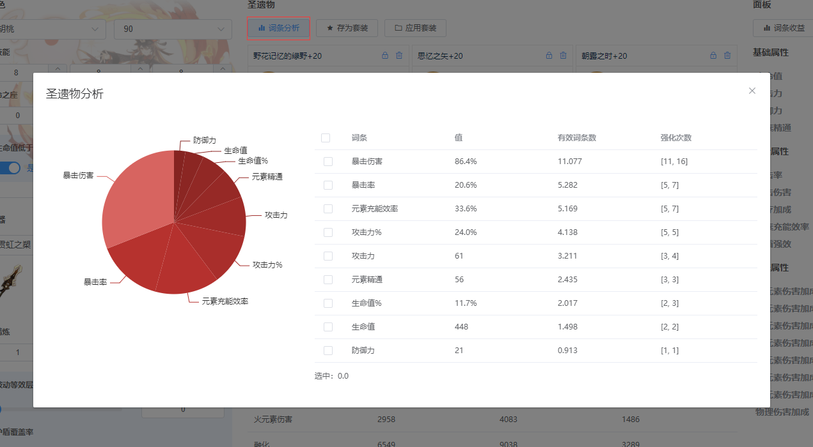
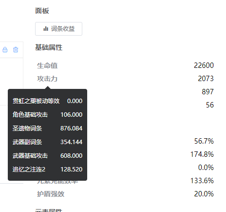
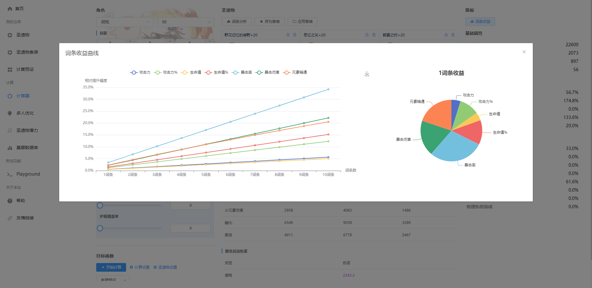

# 属性与圣遗物分析
可以查看当前状态的属性或是圣遗物分析

## 词条分析

饼图展示了词条的数量，显然在上图中双爆词条比较大。  
右侧可以选择不同的词条统计总词条。

> **注意** 单次强化的最大值为1词条

## 面板构成
鼠标移至属面板属性名称上可以得到属性的详细构成

## 词条收益
词条收益表示在当前配置、目标函数和圣遗物下，圣遗物的词条收益，可以指导圣遗物的未来养成方向

左侧折线图表示不同词条数量时，不同词条的相对提升幅度。

右侧饼图表示单词条时不同词条的提升幅度。