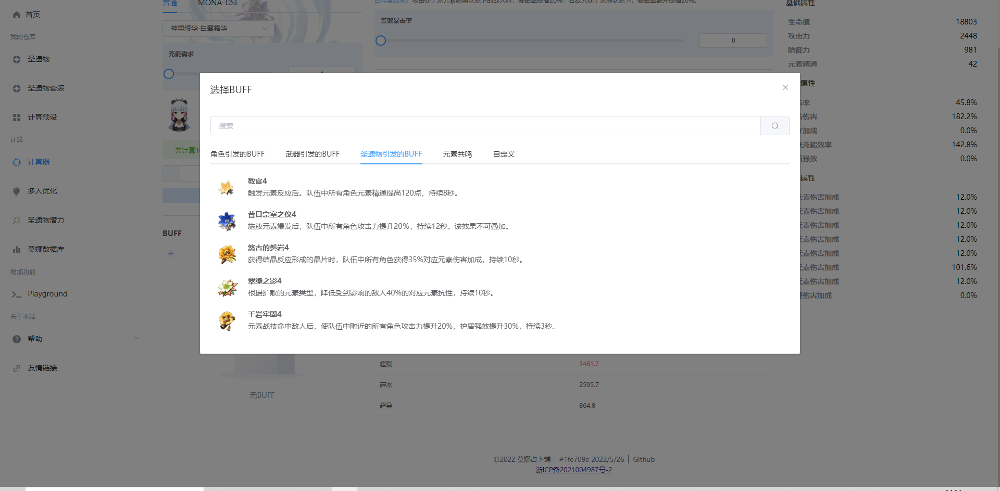
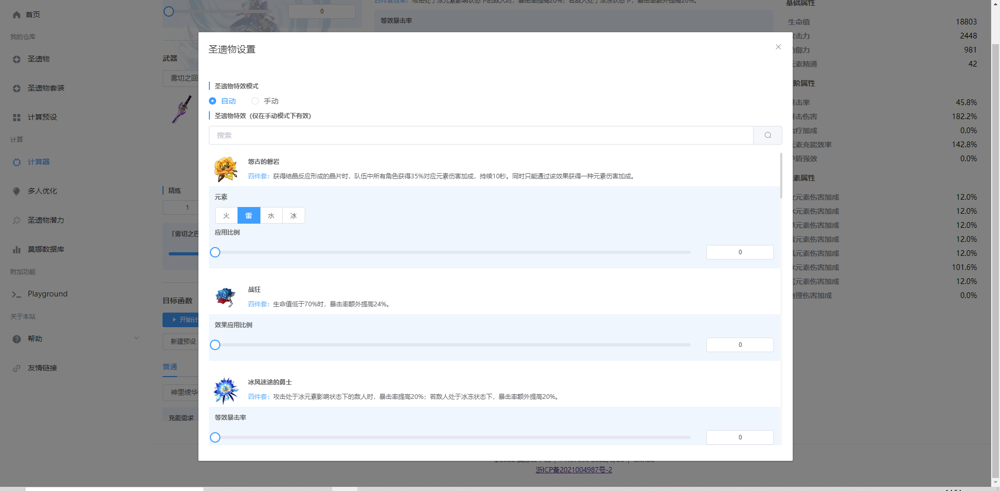
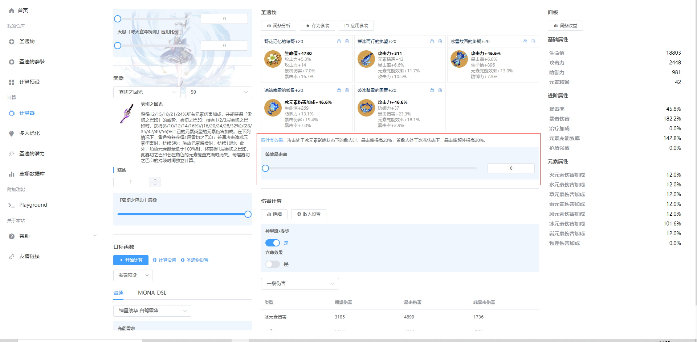

# BUFF
在莫娜占卜铺，BUFF可以自定义增删，或是锁定。

点击BUFF面板下面的“+”号，即可选择增加BUFF

## 圣遗物引发的BUFF
其他的BUFF比较直观，然而圣遗物相关的设置出现在了三个地方：BUFF、圣遗物设置以及中间面板的圣遗物参数

- 从原则上，圣遗物BUFF指由别人引发，作用到自己以外的角色的效果，例如千岩、宗室等。

- 圣遗物设置指配装过程中圣遗物四件套的效果应用比例，与配装相关，与计算器无关

- 中间面板的圣遗物参数指计算器应用的圣遗物效果比例，与计算器相关，与配装无关

