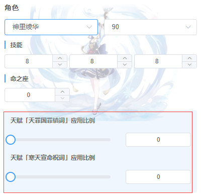

# 角色与武器

角色设置包含4部分
- 角色名称和等级
- 技能等级
- 命之座
- 其他配置

武器设置包括：
- 武器名称和等级
- 精炼
- 其他配置

我们讲一讲其他配置

## 其他配置
众所周知，原神的角色有许多天赋，某些天赋会增加伤害，但是其效果并不是100%覆盖的，因此，有必要通过某种配置选择到底需不需要应用这个效果，以及应用多少比例。

从数学上来讲，只有*不应用*和*100%应用*是不够精确的。因此，对于大多数配置，莫娜都提供类一个浮点值的应用比例。

例如，神里绫华的天赋可以选择应用比例：

武器的被动特效也是一样，一般情况下很难得到100%的覆盖率，因此会提供一个浮点数以自定义被动的应用比例。

如果你觉得太麻烦，则可以选择默认值，或者直接拉满，从经验上来讲，配装结果不会有太大区别。