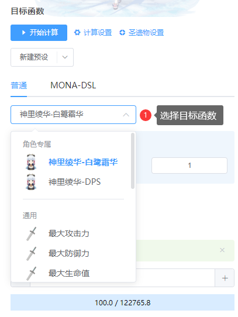
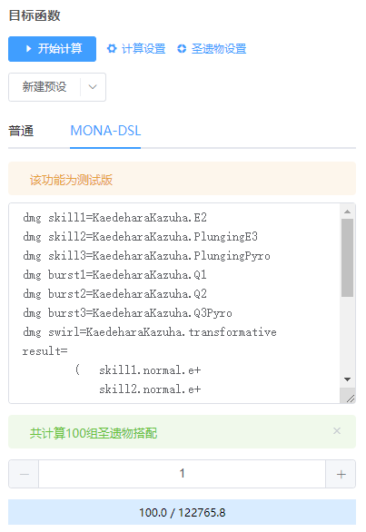
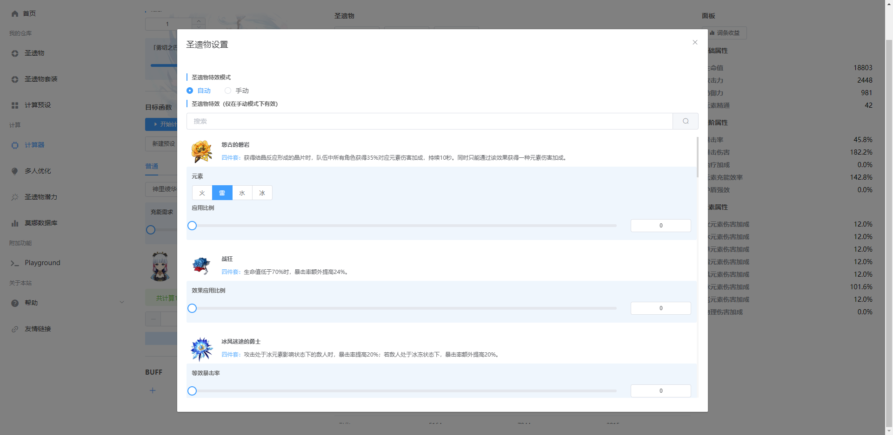

# 目标函数
配装需要伴随着目标函数，同一个角色可能有着不同的玩法，其圣遗物搭配可能是不同的。  
目标函数就是为了这个概念而生的。意思就是对不同的圣遗物，使用不同的数学公式得到不同的值，以反映不同的玩法流派等。

目标函数有两种，一种是莫娜内置的目标函数，可以直接在目标函数下进行选择：

目标函数可能有着不同的参数，该参数控制了目标函数的优化目标。例如，胡桃的默认目标函数可以指定融化占比和蒸发占比。

第二种是通过MONA-DSL进行自定义

## 计算设置
有时候可能想要限定最小充能，最小元素精通等属性，或者需要固定套装、固定某个位置的主词条等。在计算设置页面可以进行相关设置。

1. 算法。推荐使用A*算法。仅在计算缓慢，需要更加高速计算时使用启发式剪枝算法
2. 限定套装。非必要不限定套装
3. 限定主词条。非必要不限定，可能会得不到最优解
4. 限定最小值。可以适当限定充能，不推荐限定其他值
5. 过滤不参与计算的圣遗物。

## 圣遗物设置
不同的圣遗物套装有着不同的特效。且这些特效对于不同的角色其覆盖率也不同。对于同一个角色，不同的圣遗物特效也并不是都是全覆盖。  
因此，有必要设置不同套装的应用比例，以期更加精确地得到配装结果。

圣遗物设置有两种模式
1. 自动。根据当前目标函数，选择符合常理的圣遗物参数
2. 手动。如果希望手动设置圣遗物参数，可以手动设置。

如果嫌麻烦，直接使用默认即可

> **警告** 如果使用DSL，默认圣遗物设置将与当前选择的目标函数的一致，也可以自定义。

