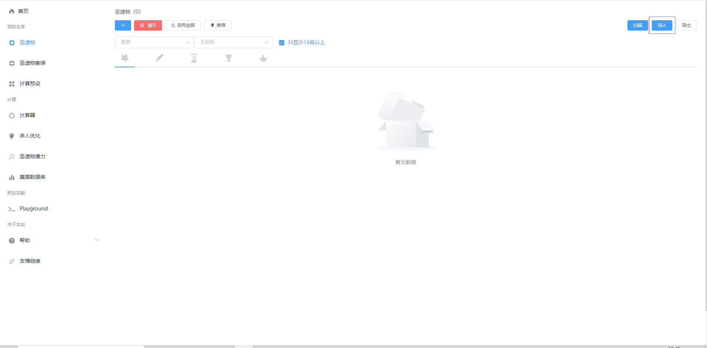
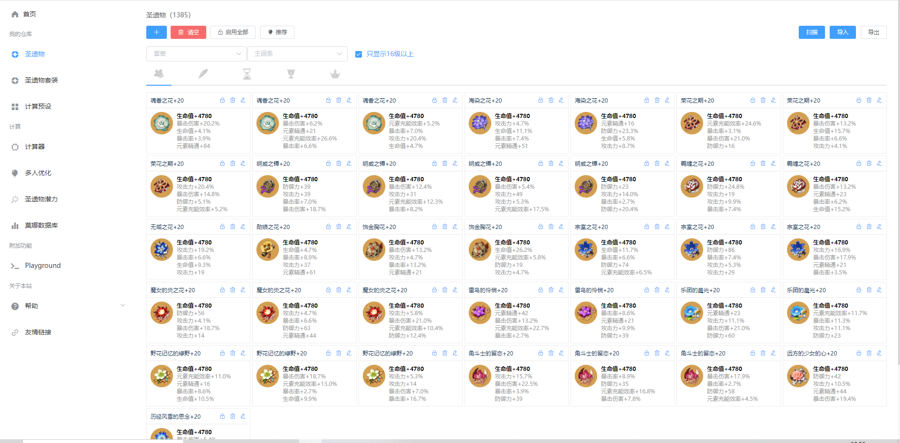
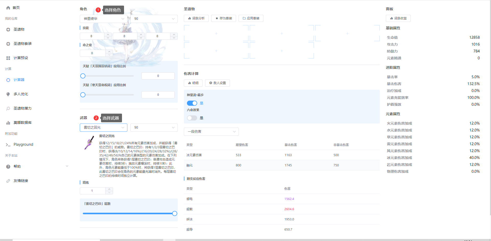
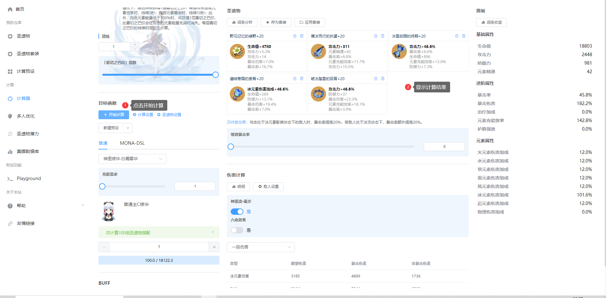
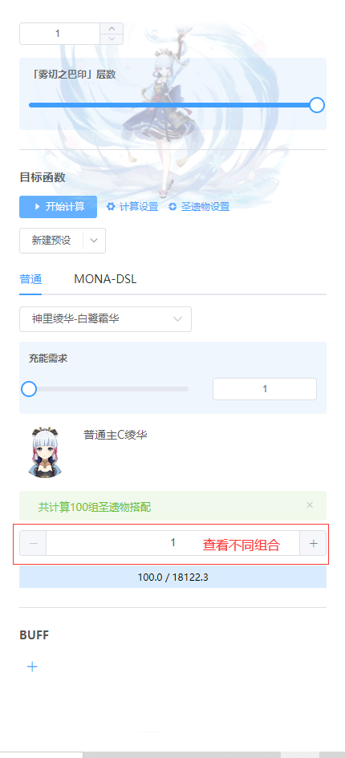

# 快速开始

## 扫描圣遗物
你可以通过两种方法扫描圣遗物 

### 1. 下载圣遗物扫描软件，并将其导入至莫娜占卜铺
扫描软件推荐使用 [Yas](https://github.com/wormtql/yas/releases)  
另外可以使用 [Amenoma](https://github.com/daydreaming666/Amenoma/releases)

### 2. 直接使用PC网页版莫娜的扫描功能
该按钮需要使用椰羊控制器，其本质为本地启动Yas扫描，并通过websocket与网站进行通信。

请直接跟随页内指引进行操作。

导入成功后如图：

## 选择角色与武器开始计算
前往 [计算器](https://mona-uranai.com/calculate) 页面，在这里可以进行伤害的计算、圣遗物的配装、分析等操作。

以神里绫华为例，我们需要对主C绫华进行配装，首先选择角色和武器：

此外的配置可以不进行选择，直接将左侧面板往下滚动，点击开始计算即可，计算完毕后将在中间面板显示最优圣遗物  
**不用担心由于设置不正确而导致配装不是最优，因为会默认使用合理的参数设置**。

计算完成后将得到至多100组圣遗物搭配，按降序排列，可以在左侧面板下选择不同的组合查看。

